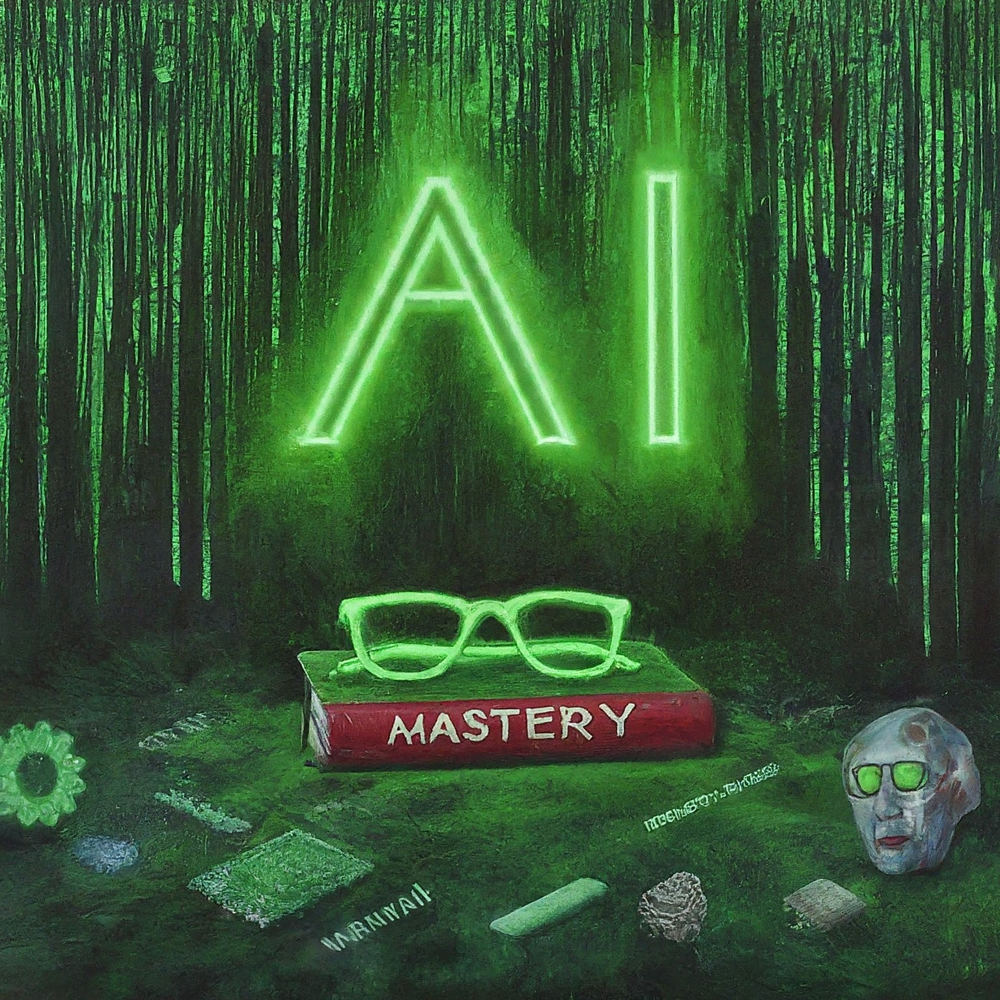

<div align="center">
    <h1>
        <br/>
        
        <br/>
        Microsoft AI Code Academy
    </h1>
    <hr/>
</div>

<p align="center">
  <a href="https://www.python.org/downloads/release/python-3120/">
    
  </a>
  <a href="https://python-poetry.org/">
    
  </a>
  <a href="https://github.com/qhreul/langchain-util/blob/develop/LICENSE">
    
  </a>
</p>

- [Description](#description)
- [Development](#development)
  - [Requirements](#requirements)
  - [Environment Variables](#environment-variables)
  - [How to prepare the environment](#how-to-prepare-the-environment) 

## Description <a name="description"></a>
[Microsoft](https://learn.microsoft.com/en-us/training/career-paths/ai-engineer) offers several learning paths for 
Artificial intelligence (AI) engineers. This role requires combined expertise in software development, programming, 
data science and data engineering. 

This repository includes code related to the completion of different 
[Microsoft Applied Skills](https://learn.microsoft.com/en-us/credentials/support/appliedskills-process-overview) 
courses. The incentive to complete these Applied Skills course is to get credentials that demonstrates proficiency in a 
specific, scenario-based skill so I can make a bigger impact on every project, at my organization, and in my career.

## Development <a name="development"></a>

### Requirements <a name="requirements"></a>
* Git
* Python >= 3.11
* Poetry >= 1.7.0

### Environment Variables <a name="environment-variables"></a>
| **Name**               | **Description**                                    | **Default**     |
|------------------------|----------------------------------------------------|-----------------|
| `LOG_DIR`              | Location of the logging files                      | logs/           |
| `LOG_LEVEL`            | Logging level to be applied during execution       | INFO            |

### How to prepare the environment <a name="how-to-prepare-the-environment"></a>
* Install dependencies
  ```
  poetry install
  ```
  ---
  **NOTE**
  To update dependencies, it may be needed to run the following command prior to installing the packages:
  ```
  poetry lock
  ```
  ---