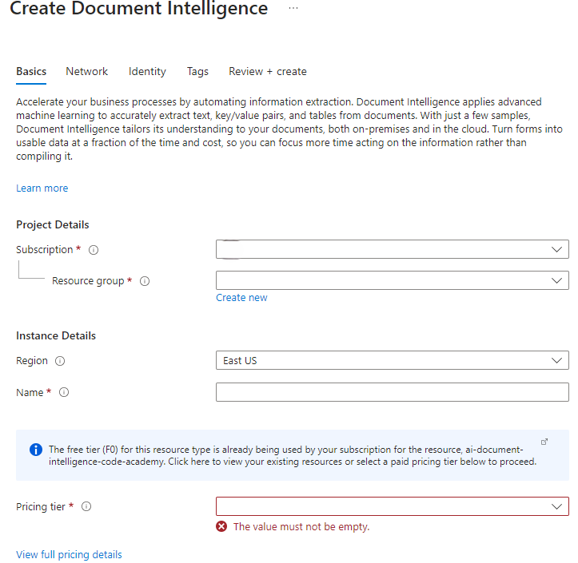
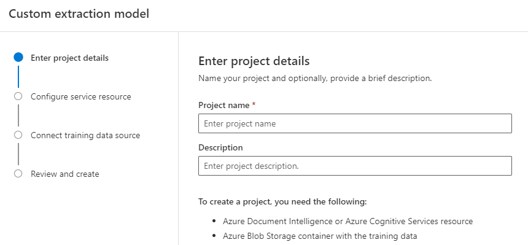
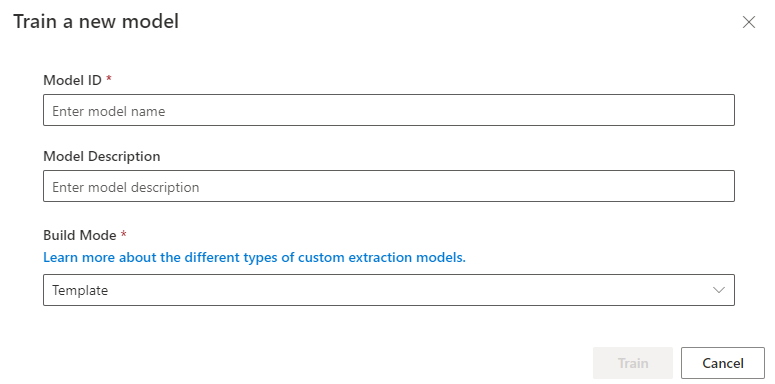

    <h1>
         
        
         
        Bounty Ledger Instructions
    </h1>
    

- [Description](#description)
- [Prerequisite](#prerequisite)
  - [Create an Azure AI Document Intelligence resource](#create-a-azure-ai-document-intelligence-resource)
  - [Upload training data to Azure Storage](#upload-training-data-to-azure-storage-accounts)
- [Train a custom model](#train-custom-model)
- [More information](#more-information)

## Description 
Suppose a company currently requires employees to manually purchase order sheets and enter the data into a database. 
They would like you to utilize AI services to improve the data entry process. You decide to build a machine learning 
model that will read the form and produce structured data that can be used to automatically update a database.

## Prerequisite 

### Create an Azure AI Document Intelligence resource 
To set up a new Azure AI Document Intelligence resource, you will need to perform the following steps:
1. In a browser, open the [Create Document Intelligence link](https://portal.azure.com/#create/Microsoft.CognitiveServicesFormRecognizer), 
sign in with the Microsoft account associated with your subscription.

    - **Subscription**: Your Azure subscription
    - **Resource group**: Select or create a resource group with a unique name such as *DocIntelligenceResources*
    - **Region**: Select a region near you
    - **Name**: Enter a globally unique name for the instance
    - **Pricing tier**: Select _Free F0_ (if you don't have a Free tier available, select _Standard S0_)
5. Click on _Review + create_ to generate a new resource of the Azure AI Document Intelligence service.
6. When the resource has been deployed, click on _Go to resource_ to access the newly create resource.
7. Click _Keys and Endpoint_ under **Resource Management** to gather information (e.g. endpoint URL, access keys) to 
configure access to the Azure AI Document Intelligence instance.

### Upload training data to Azure Storage
&#x26a0; **Note** We recommend to download [Azure Storage Explorer](https://azure.microsoft.com/en-us/products/storage/storage-explorer)
to facilitate the handling of folders / files.

Unzip [Bounty Ledger training set](../../../data/training-set/bounty-ledger-training.zip), and upload the folder to a
container in a new / pre-existing [Azure Storage Accounts](https://portal.azure.com/#view/HubsExtension/BrowseResource/resourceType/Microsoft.Storage%2FStorageAccounts).

## Train a custom model 
To train a model using the newly created Azure AI Document Intelligence resource, you will need to perform the 
following steps:
1. In a browser, open the [Document Intelligence Studio](https://documentintelligence.ai.azure.com/studio)
1. Under **Custom Model**, click on _Custom extraction models_ 
1. Under **My Projects**, click on "+ Create a project", you will then see the following popup
    
    1. Provide information for **Enter project details**:
       - **Project name**: Enter a unique name for the model training project
       - **Description**: Enter a description of the model to be trained
       - Click **Continue**
    2. Configure service resource by entering information on your [Azure AI Document Intelligence instance](#create-a-azure-ai-document-intelligence-resource)
    3. Configure training data source by entering information about [your container with training data](#upload-training-data-to-azure-storage-accounts)
1. Click **Continue** to create the project 
 &#x26a0; **Note** If the creation of the project with training data was successful, then the ✅ checkmark will appear in front of the file name.
1. Click **Train** to train the model based on the training data

    - **Model ID**: the unique identifier for the trained model (e.g. 'custom_bounty_ledger')
    - **Model Description**: the description of the trained model
    - **Build Model**: Select _Template_ from the dropdown
1. Click **Train** to generate a new custom model
1. Execute code in [custom_bounty_ledger.py](custom_bounty_ledger.py) to check that the trained model is available

## More information
For more information about the Document Intelligence service, see the [Document Intelligence documentation](https://learn.microsoft.com/azure/ai-services/document-intelligence/?azure-portal=true).

